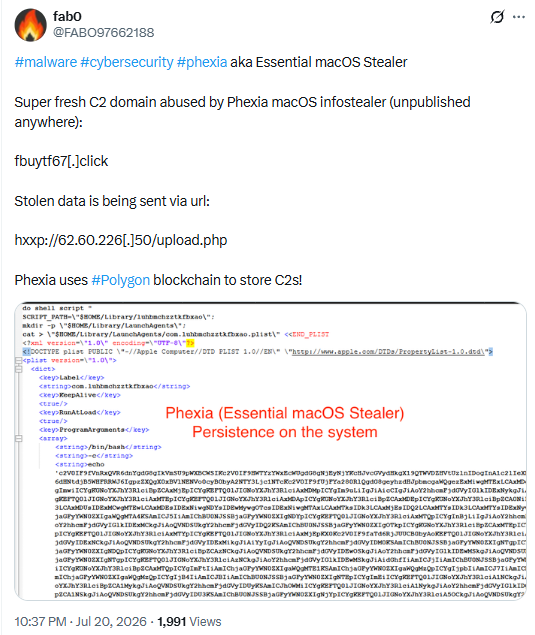
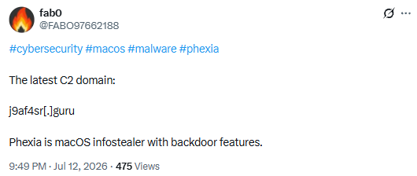
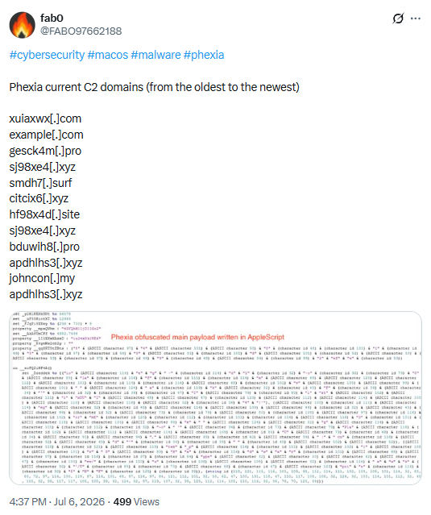
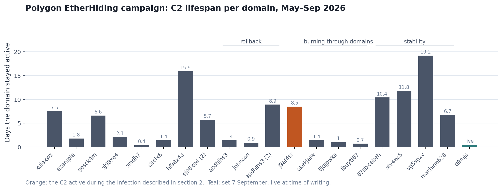
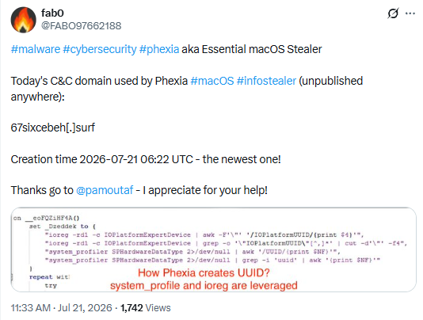
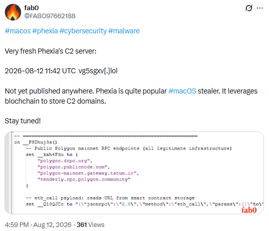
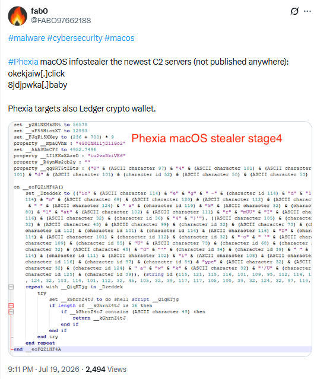

## 1. What this adds

Between June and August 2026, several teams published detailed analyses of a macOS
campaign that pairs ClickFix social engineering with EtherHiding, a technique that
stores the command-and-control address inside a public blockchain smart contract rather
than hardcoding a domain.

The malware chain is, at this point, well documented. Have I Been Squatted published
[the most complete technical breakdown](https://haveibeensquatted.com/blog/from-typosquatting-to-macos-backdoor-clickfix-blockchain-c2)
on 6 July 2026, covering the loader, the LaunchAgent persistence, the module taxonomy
and the Polygon contract itself. UnderDefense
[documented a separate delivery path](https://underdefense.com/blog/inside-a-clickfix-attack-how-veilovpn-hid-its-command-server-inside-a-polygon-smart-contract/)
through malicious Chrome extensions on 29 July. Prophet Security
[described a third](https://www.prophetsecurity.ai/blog/etherhiding-malware-macos-blockchain-c2),
with initial access consistent with fake-interview tradecraft. Earlier still,
[p0pcycle](https://p0pcycle.com/2026/06/08/c2-on-the-blockchain/) flagged the on-chain
C2 pattern in June, and [fab0](https://x.com/FABO97662188) has been publishing each new
C2 domain on X as the operator rotates it.

I am not going to re-document what those already cover well. This post adds four things.

1. **A fourth delivery vector.** The published entry paths are typosquatted lookalike
   domains, a malicious browser extension and a fake interview. There is another: a
   legitimate, widely used site, compromised, serving the ClickFix lure to a subset of
   its own visitors at its own correct address.
2. **A third campaign identifier.** The tracking ID carried by the samples in this
   delivery path matches neither of the two published ones, which places it on its own
   branch of the campaign.
3. **A consolidated on-chain timeline** running to 7 September 2026 that independently
   corroborates every domain published so far, and adds three that were not, including
   the C2 the campaign is using right now.
4. **What the infrastructure costs the operator**, and what that implies for anyone
   still fighting this with a blocklist.

Everything here is verifiable. The on-chain data can be reproduced by anyone in about
five minutes, and section 3 gives the command.

---

## 2. The fourth door

### The victim does nothing wrong

The three published delivery paths all require the target to take a step they could
have avoided. Mistyping a domain and landing on a lookalike. Installing a free VPN
extension. Entering an interview process that was never real. Each gives a defender
something to point at afterwards.

This one does not.

The user goes to a legitimate, well-known site, the correct site, at the correct
address, one they have used before. In this case a language test preparation platform,
reached while working through a writing exercise. The site has been compromised, and it
serves a fake CAPTCHA to some fraction of its visitors. That page tells the user to copy
a command and run it in Terminal.

Two things follow from that. User error stops being an available explanation, which
bounds what awareness training can realistically achieve. And the operator has a
delivery channel with organic, trusted traffic: no lure to distribute, no extension to
push past a store review, no social engineering campaign to run.

### Why the technique works at all

Nothing about this chain looks like malware to the operating system, and that is the
design.

Gatekeeper, notarisation checks and the `com.apple.quarantine` flag are all built around
one assumption: that malicious code arrives as a *file* which was downloaded and then
executed. ClickFix never produces such a file. What executes is a command line the user
typed into their own Terminal, which the system treats as a deliberate instruction from a
legitimate user. No signature check runs, no quarantine attribute is set, no notarisation
gate applies, because none of those mechanisms are looking at this path.

The tools used are Apple's own, signed and legitimate: `curl` to fetch, `osascript` to
execute, `dscl` to validate the stolen password, `security` to open the keychain. Examined
one at a time, no step in the chain is anomalous. It is only the sequence that is.

That is why static, file-based detection contributes almost nothing here, and why the
behavioural signals in section 7 carry the weight instead.

### The lure cannot be reproduced on demand

The obvious first move is to go and look at the site. Creating a fresh account, working
through content and reloading repeatedly produces nothing. Using the affected user's own
session produces nothing either.

That looks like a dead end, and it costs hours. It also pulls the investigation the
wrong way, because everything about the site checks out: legitimate, well known, not
associated with any campaign. The user mentions having first seen it promoted in a
YouTube video, and the video is clean too.

The published analyses reframe that failure as a finding. Have I Been Squatted documented
a traffic distribution and cloaking layer in front of these lures, fingerprinting each
visitor, user agent, macOS platform hints, screen and viewport dimensions, WebGL
renderer, canvas value, language, timezone, device memory and high-entropy HTTP Client
Hints before deciding what to serve. UnderDefense described the same selectivity from
the other end: a server-side flag decides which targets ever see stage two, and that
decision is not visible in the code at all.

So "I refreshed thirty times and nothing happened" does not mean the user was mistaken.
It means the visitor was not the intended audience, and the operator decided that
server-side. Treat a failed reproduction as consistent with the technique rather than as
evidence against the account you were given.

Confirmation came later, and not from any analysis. The site emailed its registered users
a security notice about unexpected CAPTCHA prompts having been served to some visitors,
said the issue had been resolved and recommended a precautionary password change. That
notice is the independent evidence for this section. Without it, the claim that a
legitimate site was compromised would rest on one user's account and an inference drawn
from the command they ran.

### A gap that cannot be closed later

On an affected host, the browser history had been cleared for exactly the window in which
this happened. Everything before and after was intact.

Selective deletion covering precisely the period of interest looks like a deliberate
pattern on first reading, and it pulls hypotheses in that direction. But the plausible
explanations are several: the user clearing it after realising something had gone wrong,
the malware doing it, or something being missed during collection. None of them can be
distinguished after the fact, because no disk image was taken before the machine was
rebuilt.

The lesson is not about the artifact. Incomplete collection produces questions that
cannot be answered later, and an unanswered question is easily filled with the wrong
hypothesis.

### What runs

The pasted command invokes `osascript`, which executes base64-encoded AppleScript. From
there the chain matches what has already been published: a user-level LaunchAgent for
persistence, an AppleScript loader that resolves its C2 by reading a Polygon smart
contract, and modules pulled from whatever host the contract currently points to.

Two details are worth calling out, because they place this squarely in the published
module taxonomy. The loader requests `bmodule`, the backdoor stage. A later request pulls
`smodule`, the full AppleScript infostealer and the heavier of the two stealer variants.
An infected host on this path is not merely enrolled, it gets actively tasked.

Credential theft behaves as documented: a dialog styled to look like a system password
prompt, with the entered password written to a dotfile in the user's home directory in
plaintext. Have I Been Squatted documented the validation step, and it is worth noting for
what it says about the design, the malware checks whether the entered password is correct
by calling `dscl . authonly`, macOS's own directory service utility, and re-prompts if it
fails. The attacker did not need to write a password check. The operating system provides
one. That value is the account password, which is also the key to the login keychain.
Beyond credentials, fab0 reports the stealer also targets Ledger cryptocurrency wallets,
consistent with the wallet-spoofing behaviour Have I Been Squatted documented.



The persistence artifact is a user-level LaunchAgent whose name is a random sixteen-character
lowercase string, matched by a directory of the same name under `~/Library`. A sample fab0
published used `lubhmchzstkfbxao`, with `KeepAlive` and `RunAtLoad` both set and the payload
carried as base64 in the plist's `ProgramArguments`.

### Recognising it at all

Knowing a command is malicious is not the same as knowing what you are dealing with. At
the time, no vendor had published anything on this campaign that a search would surface,
and the domain being contacted returned nothing from commercial threat intelligence.

What broke it open was a plain web search on that domain. It surfaced a post from
[fab0](https://x.com/FABO97662188) dated 12 July 2026, naming `j9af4sr[.]guru` as the
current C2 for a macOS infostealer with backdoor features that they track as Phexia, a
name that maps to the family Have I Been Squatted documents as Essential macOS Stealer.



That one post supplied three things no paid source did: the name of the technique,
confirmation that this was a known campaign rather than something bespoke, and a thread
leading to further infrastructure. Their subsequent posts named the next C2 domains as
the operator rotated them, along with the persistence path, the UUID generation logic and
an exfiltration endpoint and stated outright that the campaign stores its C2 addresses
on Polygon. They also run a public tracker at `clickfix[.]pro` that surfaces on-chain
activity associated with this class of malware.

That is worth stating plainly. A person posting for free had current, actionable
information about an active campaign before any commercial source did. It is not an
accident of timing; it is the same structural problem as section 6, seen from the other
end.

### The campaign identifier

Every request in this chain carries a `txid` value labelling the campaign branch. On this
delivery path it is:

```
8b636a811a6367c4860dc65ea74225a4
```

The two identifiers published to date are `c8a845e30830c48f753d01aa38927dc0` (Have I Been
Squatted, typosquat path) and `8a4e280e1159833ede425a1306c2efe5`, a related sample in the
same analysis. This is neither.

Same contract, same selector, same module names, different tracking ID and a different
way in. That is a distinct branch of the same operation rather than a coincidental
overlap and it is evidence rather than inference.

### Reading before deleting

One method note, because it cost more than anything else here.

The persistence plist is not just a persistence mechanism. In a fileless chain it *is*
the malware: the base64 payload inside it is the only copy of the code that will ever
exist, since nothing is dropped to disk to hash and nothing is uploaded anywhere to
sample. It is also the thing you most want to remove immediately.

Those two facts are in direct conflict, and the removal instinct wins unless something
stops it. Copy the artifact, decode what is inside it, keep both, then remove it. The
same applies to the browser profile: where a lure is served selectively, a victim's cache
may hold the only copy of a page nobody will ever reproduce on demand.

---

## 3. Reading the contract

The mechanism is described well elsewhere, so this is the short version. What matters is
that every claim in the next section can be verified independently, for nothing.

The contract lives at `0xA3a603F8a454a9c905b4c579Bb72628F7C15C2A0` on Polygon. It is
tiny, four functions, no source published on Polygonscan, though it resolves as
`extractor` on Blockscout. Two functions matter:

| Function | Selector | Who calls it |
| --- | --- | --- |
| `getServerURL()` | `0x2686ecea` | The malware, on every check-in |
| `setServerURL(string)` | `0xd75d1ba6` | The operator, when rotating infrastructure |

Reading it takes one command:

```
curl -s https://polygon.drpc.org -X POST \
  -H 'Content-Type: application/json' \
  --data '{"jsonrpc":"2.0","method":"eth_call","params":[{"to":"0xA3a603F8a454a9c905b4c579Bb72628F7C15C2A0","data":"0x2686ecea"},"latest"],"id":1}'
```

`eth_call` is a read-only simulation. No wallet, no gas, no signature, no record on
chain. The result is an ABI-encoded string: the second 32-byte word is its length, the
data follows. Decode it and you have today's C2.

Recovering the full history is the same idea applied to the setter calls, decoding each
transaction's input data instead of the current value.

The contract is not verified on Polygonscan, but its bytecode is readable enough to be
informative. The Solidity revert strings survive compilation intact:

```
Not owner
Empty URL
URL too long
Zero address
```

Four functions and four error conditions: an owner-gated setter, a rejection of empty
values, a length ceiling on the stored string, and a guard against transferring ownership
to the zero address. This is not a generic template someone repurposed. It was written for
this job, and written with enough care to validate its own inputs.

The point worth drawing out is the asymmetry. Every write the operator makes is a signed,
timestamped, permanent transaction visible to anyone. Every read a defender makes is free
and leaves no trace at all. The operator pays, in public, for a capability that costs us
nothing to observe.

*Scripts for both operations: [github.com/bugrasahinoglu/etherhiding-tools](https://github.com/bugrasahinoglu/etherhiding-tools)*

---

## 4. The full timeline

Two people got here before me, and on the same day. Have I Been Squatted published the
on-chain history on 6 July 2026, running to seventeen entries. fab0 posted the same
sequence on X that afternoon, oldest to newest, duplicates included and then kept going,
publishing each new domain as the operator rotated it.

Reconstructing the history from the chain reproduces both. Every domain fab0 posted
appears in the on-chain record at the time they said it did: their 21 July post gives a
creation time of 06:22 UTC and the transaction is timestamped 06:22 UTC; their 12 August
post gives 11:42 UTC and so does the chain. Two independent methods, same answer. That is
worth more than a new indicator, because it means the method in section 3 can be trusted
by anyone who wants to run it themselves.

One limitation of that method is worth stating, because it took a manual step to close.
Reconstructing from `setServerURL` calls recovers every *update* but not the value written
by the constructor at deployment that argument is appended to the deploy bytecode rather
than sent as a function call. Reading the creation transaction's input data directly
recovers it: `vk.com`, written bare, without the scheme and trailing slash the same domain
carries when it reappears as entry 3 seventeen days later. Small thing, but consistent
with an operator who had not yet settled the format.



Below is the consolidated history as of 7 September 2026, with the source of each entry
marked.

| # | Timestamp (UTC) | Block | C2 value | Note |
| --- | --- | --- | --- | --- |
| 0 | 2026-05-01 17:22 | deploy | `vk[.]com` | constructor |
| 1 | 2026-05-01 18:07 | 86269411 | `rutube[.]ru` | test |
| 2 | 2026-05-01 18:09 | 86269464 | `facebook[.]com` | test |
| 3 | 2026-05-18 02:46 | 87047231 | `https://vk[.]com/` | test |
| 4 | 2026-05-18 03:00 | 87047732 | `xuiaxwx[.]com` | first live C2 · HIBS · fab0, 6 Jul |
| 5 | 2026-05-25 13:59 | 87415908 | `example[.]com` | test · listed by fab0 |
| 6 | 2026-05-27 09:47 | 87506003 | `gesck4m[.]pro` | HIBS · fab0, 6 Jul |
| 7 | 2026-06-02 23:02 | 87829516 | `sj98xe4[.]xyz` | HIBS · fab0, 6 Jul |
| 8 | 2026-06-05 01:29 | 87945305 | `smdh7[.]surf` | HIBS · fab0, 6 Jul |
| 9 | 2026-06-05 10:04 | 87965920 | `citcix6[.]xyz` | HIBS · fab0, 6 Jul |
| 10 | 2026-06-06 20:02 | 88047452 | `hf98x4d[.]site` | HIBS · fab0, 6 Jul |
| 11 | 2026-06-22 18:35 | 88965562 | `sj98xe4[.]xyz` | reuse · HIBS · fab0 |
| 12 | 2026-06-28 10:41 | 89292177 | `bduwih8[.]pro` | HIBS · fab0, 6 Jul |
| 13 | 2026-06-29 20:10 | 89372572 | `apdhlhs3[.]xyz` | HIBS · fab0, 6 Jul |
| 14 | 2026-06-29 20:14 | 89372705 | `johncon[.]my` | HIBS · fab0, 6 Jul |
| 15 | 2026-06-29 20:14 | 89372722 | `johncon[.]my` | rewritten |
| 16 | 2026-06-30 18:23 | 89425886 | `apdhlhs3[.]xyz` | reverted · HIBS · fab0 |
| 17 | 2026-07-09 17:03 | 89941080 | `j9af4sr[.]guru` | fab0, 12 Jul |
| 18 | 2026-07-18 04:29 | 90429318 | `okekjaiw[.]click` | fab0, 19 Jul |
| 19 | 2026-07-19 13:50 | 90509344 | `8jdjpwka[.]baby` | fab0, 19 Jul |
| 20 | 2026-07-20 13:06 | 90565182 | `fbuytf67[.]click` | fab0, 20 Jul |
| 21 | 2026-07-21 06:22 | 90606619 | `67sixcebeh[.]surf` | fab0, 21 Jul |
| **22** | **2026-07-31 16:28** | **91206870** | **`stv4ec5[.]shop`** | **not seen published** |
| 23 | 2026-08-12 11:42 | 91886606 | `vg5sgxv[.]lol` | fab0, 12 Aug |
| **24** | **2026-08-31 17:11** | **92994178** | **`machine628[.]baby`** | **not seen published** |
| **25** | **2026-09-07 09:50** | **93379742** | **`d9mjs[.]sbs`** | **live now · not seen published** |

Almost all of this is already public. Entries 1–16 appear in Have I Been Squatted's table
and, from entry 4 onward, in fab0's 6 July post. Entries 17-21 and 23 were posted by fab0
as they happened, usually within hours. That leaves three: `stv4ec5[.]shop` from 31 July,
`machine628[.]baby` from 31 August, and entry 25.

Entry 25 arrived while this article was being finalised. An earlier draft named
`machine628[.]baby` as the current C2, which it had been for six days. On 7 September at
09:50 UTC the operator wrote `d9mjs[.]sbs`, and every infected host picked it up on its
next check-in. The public record has not caught up at the time of writing, and by the time
you read this it may well have rotated again.

That is the whole argument of section 6, demonstrated inside the time it took to write
this post. Public tracking of this campaign has been genuinely good, faster and more
complete than the commercial feeds and it still has gaps, and one of those gaps is
always the address in use right now. Anyone can close it in five minutes by reading the
contract themselves.

### Before it started

The contract was funded and deployed on 1 May, then tested five minutes later with
placeholder values, two consumer platforms, and later `example.com`, the domain reserved
by RFC 2606 for exactly this purpose. Entry 3 is written with a scheme and a trailing
slash, unlike every other entry, which suggests the format was still being settled.

Then seventeen days of nothing, before the first real C2 on 18 May.

This is a view you almost never get: an operator's staging and testing phase, preserved
permanently because they did it on a public ledger. I am deliberately not building an
attribution argument on which platforms were used as test values. It is an observation,
not a conclusion.

### Three phases

Averaged across the whole period this comes to one rotation every five days, which hides
the actual shape.



**29-30 June: a rollback.** Entry 13, a change four minutes later, the same value written
twice, then a revert to entry 13 the following day. Something did not work. The
operator's bad afternoon is on chain forever.

**18-21 July: burning through domains.** Four domains in four days: 1.4, 1.0 and 0.7
days each. This is what pressure looks like from inside an operation.

**August: stability.** Ten days, then twelve, then nineteen. They found ground that held.

---

## 5. Three dollars

The wallet controlling the contract was funded with 30 POL on 1 May 2026 at 17:17 UTC.
The contract was deployed five minutes later.

Thirty POL is under three dollars.

Across 25 rotations over 129 days the operator has spent 0.3181 POL in gas, roughly one
percent of the funding. At that rate the remaining balance covers something on the order
of two thousand further rotations. At the observed five day cadence, that is decades of
runway.

There is no registrar to notify, no hosting provider to contact and no domain seizure
that changes anything, because the domain was never the C2. It was only ever the exit.
Whatever is done to the current host, the contract answers the next check-in with a new
one, and it can keep doing that for longer than most of us will be working.

That is the economics of this technique, and it is not a fair fight.

---

## 6. Why indicator feeds lose this race

The timeline in section 4 is also a measurement of how fast the public record can move,
and it can be read without any private data at all.

Have I Been Squatted's table, the most complete vendor-side account, stops on 1 July. The
fastest and most complete source by a wide margin has been fab0, who published the full
sequence on 6 July and then posted each new domain within hours of the rotation and even
there, two entries are missing, one of them the address in use today. Meanwhile the contract has answered every check-in correctly and instantly,
throughout, for anyone who asked it.

This is not a story about badly configured feeds. Indicator distribution has a floor.
Someone has to observe the new domain, attribute it to the campaign, publish it and have
it propagate. That takes hours at best and weeks at worst. The operator changes the
answer in a single transaction that costs about a cent and reaches every infected host on
its next check-in.

Against this technique, an indicator feed is not late by accident. It is late
structurally. And the fastest source available during this investigation was not a
commercial one, it was a person posting for free.

**So stop watching the domains and start watching the contract.**

A scheduled read of `getServerURL()` is a few lines of code, runs for nothing and needs no
API key or vendor relationship. It returns the current C2 the moment it changes ahead of
any feed, and often before the operator's next victim connects. The contract address is
the durable indicator. Everything it returns is disposable by design.

If an environment has no legitimate reason to speak to Polygon RPC endpoints, the same
fact supplies a second, cheaper control: the read itself is a detection opportunity,
because the malware has to make it too.

---

## 7. Detection notes

Start with timing. This chain completes in minutes, while a detection that only alerts is
still waiting on a human. Whatever distance sits between an alert firing and someone
acting on it belongs to the attacker. UnderDefense reported the same shape: their endpoint
rule was in detect-only mode, so nothing was blocked automatically and a person had to see
it first. It is worth deciding, rule by rule, whether detect-only is the right posture for
something that finishes this fast.

Have I Been Squatted's artifact list is thorough and I will not reproduce it. These are the
four behaviours I would hunt for first, in order.

**A non-browser process making Polygon JSON-RPC calls.** In an environment with no
legitimate Web3 use this is close to a standalone signal. It is also the one step the
malware cannot skip: without it, it does not know its own C2.

**`curl` output piped directly into `osascript`.** On macOS there is almost no benign
version of this. It is the shape of the command rather than any particular domain that
gives it away, which is what makes a verdict possible within minutes of first looking.

**A process ancestry change.** Initial execution has a terminal parent and an attached
TTY, consistent with a person pasting something. The same logic reappearing later under
the service manager with no TTY is persistence. Separating a one-time human action from an
established loop is a useful triage signal by itself.

**Host fingerprinting through `ioreg` and `system_profiler`.** fab0 documented how this
malware derives a machine identifier, querying `IOPlatformExpertDevice` via `ioreg` and
falling back to `system_profiler SPHardwareDataType`. Both are legitimate tools with
legitimate uses, but a shell pipeline extracting `IOPlatformUUID` shortly after a
terminal-parented process spawns is not a normal pairing.



**High-entropy hostnames on low-cost TLDs.** Every domain in section 4 is a random string
on a cheap TLD: `.xyz`, `.surf`, `.site`, `.click`, `.baby`, `.shop`, `.lol`, `.guru`,
`.pro`, `.my`. Worth alerting on where such traffic is rare but be honest that this is
chasing the exit, not the source.

### ATT&CK mapping

| Tactic | Technique |
| --- | --- |
| Initial Access | T1189 - Drive-by Compromise |
| Execution | T1204.004 - User Execution: Malicious Copy and Paste |
| Execution | T1059.002 - Command and Scripting Interpreter: AppleScript |
| Defense Evasion | T1027 - Obfuscated Files or Information |
| Credential Access | T1056.002 - Input Capture: GUI Input Capture |
| Credential Access | T1555.001 - Credentials from Password Stores: Keychain |
| Persistence | T1543.001 - Create or Modify System Process: Launch Agent |
| Command and Control | **T1102.001 - Web Service: Dead Drop Resolver** |
| Exfiltration | T1041 - Exfiltration Over C2 Channel |

The one worth dwelling on is T1102.001. A dead drop resolver is a technique where malware
retrieves its real C2 address from a location an attacker controls but does not own
classically a social media bio or a paste site, chosen because the traffic looks ordinary
and the platform absorbs the takedown pressure.

EtherHiding is that technique with the takedown pressure removed entirely. There is no
platform to report to, no account to suspend, no terms of service to invoke. The resolver
is a public ledger, and the operator's write access to it cost about a cent.

Everything in this post follows from that one substitution.

---

## 8. Indicators

**Durable - this is the one that matters**

| Type | Value |
| --- | --- |
| Polygon smart contract | `0xA3a603F8a454a9c905b4c579Bb72628F7C15C2A0` |
| Getter selector | `0x2686ecea` (`getServerURL()`) |
| Setter selector | `0xd75d1ba6` (`setServerURL(string)`) |
| Controlling wallet | `0x363aeaf1f67f1fb7abddc3f9806a301f1c64abe3` |

**Campaign identifier**

`8b636a811a6367c4860dc65ea74225a4` - distinct from the two published identifiers, and
associated with the compromised-legitimate-site delivery path described above.

**Persistence**

A user-level LaunchAgent plist is the persistence mechanism on this chain. The naming
pattern comes from fab0's analysis; the name itself is random per sample, so treat the
pattern as the indicator rather than the example.

| Type | Value |
| --- | --- |
| Loader directory | `$HOME/Library/<16 random lowercase chars>` |
| LaunchAgent | `$HOME/Library/LaunchAgents/com.<same 16 chars>.plist` |
| Observed example | `lubhmchzstkfbxao` (fab0, 20 July) |

**Reported by fab0**

| Type | Value |
| --- | --- |
| Exfiltration endpoint | `hxxp://62.60.226[.]50/upload[.]php` |

**RPC endpoints**



Have I Been Squatted documented a four-endpoint failover list, and fab0 independently
published the same list from the malware source: `polygon.drpc[.]org`,
`polygon.publicnode[.]com`, `polygon-mainnet.gateway.tatum[.]io`,
`tenderly.rpc.polygon[.]community`.

**Disposable - every C2 value from section 4**

`xuiaxwx[.]com`, `gesck4m[.]pro`, `sj98xe4[.]xyz`, `smdh7[.]surf`, `citcix6[.]xyz`,
`hf98x4d[.]site`, `bduwih8[.]pro`, `apdhlhs3[.]xyz`, `johncon[.]my`, `j9af4sr[.]guru`,
`okekjaiw[.]click`, `8jdjpwka[.]baby`, `fbuytf67[.]click`, `67sixcebeh[.]surf`,
`stv4ec5[.]shop`, `vg5sgxv[.]lol`, `machine628[.]baby`, `d9mjs[.]sbs`

Entries 1–3 and 5 in the table are placeholder values written during testing, not C2
infrastructure. Do not block them.

---

## 9. Credit and sources

Almost everything I know about the internals of this malware, I learned from work
published before this post.

[Have I Been Squatted](https://haveibeensquatted.com/blog/from-typosquatting-to-macos-backdoor-clickfix-blockchain-c2)
produced the definitive technical breakdown: the loader, the module taxonomy, the
credential theft path and the first published on-chain timeline, which this post extends
rather than replaces.
[UnderDefense](https://underdefense.com/blog/inside-a-clickfix-attack-how-veilovpn-hid-its-command-server-inside-a-polygon-smart-contract/)
documented the browser-extension delivery path and the server-side targeting that explains
why the lure could not be reproduced on demand.
[Prophet Security](https://www.prophetsecurity.ai/blog/etherhiding-malware-macos-blockchain-c2)
covered a third delivery path and reached the same conclusion about monitoring the
contract rather than the domains.
[p0pcycle](https://p0pcycle.com/2026/06/08/c2-on-the-blockchain/) flagged the on-chain C2
pattern in this campaign before any of them.

Separately, and deserving more attention than it gets:
[fab0](https://x.com/FABO97662188) has been publishing this infrastructure publicly and in
near real time throughout. Their 12 July post is the reason this campaign was identified at
all in the case described here. Their 6 July post lists the full C2 sequence to that date;
every subsequent rotation but two appeared on their timeline within hours, and the on-chain
record confirms every one of them. The persistence artifact, the exfiltration endpoint, the
host-fingerprinting logic, the Ledger targeting and the RPC failover list in this post all
come from their analysis. They also run the tracker at `clickfix[.]pro`. Unfunded,
uncredited work like that carries more of this field than most of us admit.

Referenced posts, in case they become unavailable, every domain in them is independently
verifiable in the on-chain record above, so nothing here rests on a link staying up:

- [6 July 2026 - full C2 sequence to date](https://x.com/FABO97662188/status/2074125545026244795)
- [12 July 2026 - `j9af4sr[.]guru`](https://x.com/FABO97662188/status/2076378510923284785)
- [19 July 2026 - `okekjaiw[.]click`, `8jdjpwka[.]baby`](https://x.com/FABO97662188/status/2078905505418760481)



- [20 July 2026 - `fbuytf67[.]click`, exfiltration endpoint, persistence plist](https://x.com/FABO97662188/status/2079289679585628308)
- [21 July 2026 - `67sixcebeh[.]surf`, UUID generation](https://x.com/FABO97662188/status/2079484948302450870)
- [12 August 2026 - `vg5sgxv[.]lol`, RPC endpoint list](https://x.com/FABO97662188/status/2087539431045509550)

If you are responding to something that looks like this, read theirs first. This post adds
the door that has not been written up, three rotations the public record missed including
the one in use today, and the arithmetic on what it costs to run.

---

**Mehmet Buğra Şahinoğlu** · Senior Cybersecurity Analyst · mehmet@bugrasahinoglu.com

*The views and analysis here are my own. All on-chain data in this article is publicly
verifiable; tooling is linked above.*

*If you have seen this campaign through a different delivery path, I would like to hear
about it.*
